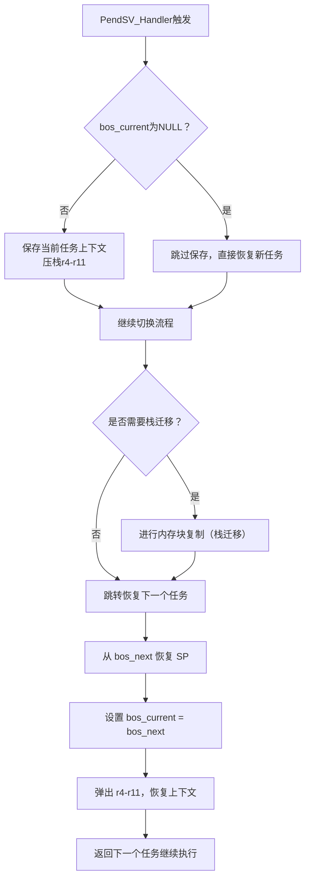

仓库：https://gitee.com/event-os/basic-os

在嵌入式开发中，操作系统往往是被绕开的“高级选项”；

对很多开发者而言，裸机开发已经足够：主循环、定时中断、状态机……能跑、够用、成本低；然而，项目一旦变得复杂，系统结构很容易变得混乱不堪，任务交叉、逻辑耦合、维护困难，最终演变为“能改的都不敢动”；

这时候，一套**结构清晰、运行可靠、资源占用极低**的轻量操作系统就显得尤为重要；

**Basic OS** 正是为此而生；它是一个基于事件驱动模型设计的微型嵌入式操作系统，拥有清晰的调度结构、极低的内存开销，以及良好的可读性与扩展性；哪怕在 M0 上，也能运行得游刃有余；

不追求复杂的线程抢占、不依赖高级硬件特性，Basic OS 关注的是对小型系统结构化管理的一种务实方案；

本篇文章将从整体架构出发，带你一步步了解 Basic OS 的设计理念、核心机制以及使用方法，帮助你在裸机开发和重量级 RTOS 之间，找到一个刚刚好的选择；

> 顺带一提，作者还有一个更完整的项目叫 **Event OS**，之后如果用到了，我也会写成笔记记录下来；

## 设计理念

### 为小RAM MCU而生

BasicOS 的设计出发点非常明确：**针对 RAM 紧张的嵌入式系统（例如仅 8KB 的 Cortex-M0/M3）**；
传统 RTOS 在每个任务上都要分配独立栈空间，这在小资源芯片上是奢侈的；而 BasicOS 采用 **“共享任务栈”** 的方式，实现了任务切换与栈空间复用的兼顾，极大地压缩了内存开销，为低成本 MCU 系统量身定制；

> 目标：让 RTOS 能在资源极度受限的 MCU 上运行自如；

### 极简协作式内核，不抢占也高效

BasicOS 明确定位为 **协作式内核**，不使用抢占调度，任务切换完全由用户控制；

协作式内核的优势在于：
- 无隐式中断上下文切换
- 更低的调试成本
- 避免共享资源竞争
- 执行流程更加可预测、逻辑更清晰

BasicOS 的设计理念认为：**大多数嵌入式产品并不需要“毫秒级以下”的硬实时**；对于 10ms 级别的任务响应，协作式足够胜任，而且更加稳定、易于维护；

### 共享栈是技术核心与突破

BasicOS 最引人注目的技术，是它引入了在 32 位 ARM 芯片中非常罕见的**任务共享栈机制**；

每次任务切换时，系统会将前一个任务的栈数据压缩保存，当前任务的栈重新展开；这种机制虽然带来一些上下文切换开销，但换来的，是大幅度降低的 RAM 消耗：
- 每个任务只占用 16 字节元数据
- 共享同一个运行栈
- 显著提高 RAM 利用率

> 这是 BasicOS 区别于其他 RTOS 的最大技术特征和未来持续发展的主轴；

### 轻学习曲线，亲民易用

相比更先进但入门门槛更高的 EventOS Nano（引入面向对象、事件驱动、控制反转等概念），BasicOS 明显更具普适性：
- C语言风格直观
- 简单 API（例如 bos_delay_ms、bos_task_export）
- 明确的任务结构
- 清晰的调度逻辑

这降低了嵌入式初学者使用 RTOS 的门槛，也便于项目快速落地；

## 核心机制

### PendSV_Handler

这是 Cortex-M 处理器专用于 RTOS 上下文切换的异常向量，BasicOS 也采用它来完成任务切换；

基本流程如下：



> 在 BasicOS 中，任务主动让出 CPU（例如调用 bos_yield()）会触发 PendSV 异常，从而进入上下文切换流程；

### 关键变量作用说明（从 .s 文件可见）：

| 变量名 | 说明 |
| ----- | ---- |
| bos_current | 当前运行任务的控制块指针 |
| bos_next | 准备运行的下一个任务的控制块指针 |
| addr_source | 当前任务栈需要迁移的数据源地址 |
| addr_target | 下一个任务栈的目标地址（即 SP 指针新位置） |
| copy_size | 栈数据迁移的大小（以字节计） |

### 任务上下文保存

在当前任务退出时（即任务切换之前）：

```asm
PUSH {r4-r7}       ; 先保存低寄存器
MOV  r4, r8
MOV  r5, r9
MOV  r6, r10
MOV  r7, r11
PUSH {r4-r7}       ; 再保存高寄存器
```

保存的寄存器集合为：r4-r11，这是 ARM Cortex-M 在 RTOS 中典型的 **callee-saved 寄存器集合**；

### 恢复任务上下文

在新任务切换进来前：

```asm
POP {r4-r7}
MOV r8, r4
MOV r9, r5
MOV r10, r6
MOV r11, r7
POP {r4-r7}
```

### 共享栈的实现：运行时栈数据拷贝机制

**这是 BasicOS 与普通 RTOS 最大的不同**：
- 普通 RTOS 做法：每个任务独立分配一段栈空间，切换时只需切换 SP；
- BasicOS 做法：所有任务共用一段物理栈空间，切换时必须将 上一个任务的栈数据搬走，并将下一个任务的栈内容 搬进当前栈位置；

**实现方式：**
- 判断 addr_target 和 addr_source 的关系，决定复制方向（前向或逆向）
- 以 word（4字节）为单位，逐字节移动任务的完整栈内容
- Loop2_P：前向复制（正序）
- Loop2_N：逆向复制（反向，避免内存重叠）

### 关键 API 实现简析

bos_critical_enter / bos_critical_exit：用于进入/退出临界区，避免任务切换导致的数据竞争；

```asm
CPSID I  ; 禁用中断，进入临界区
CPSIE I  ; 开启中断，退出临界区
```

协作式内核也需要临界保护，防止任务间修改共享数据时出现竞态；

get_sp_value：获取当前任务的栈指针，可用于调试或任务切换前的状态保存；

```asm
MOV r0, sp ; 读取当前任务的栈顶
```

## 总结

从裸机开发出发，BasicOS 提供了一种极具实用性的**“中间形态”**：它没有传统 RTOS 的复杂调度和庞大资源开销，也不再依赖“主循环 + 中断”这种高度耦合的代码结构，而是通过共享栈协作式调度的核心机制，在资源受限的 Cortex-M0/M3 等平台上，达到了结构清晰、可维护性强、资源使用极小的理想状态；

它的设计哲学并不激进，但足够务实：以极简的结构解决系统管理问题，以极低的门槛带来结构化开发的好处，尤其适合那些希望从裸机过渡到更系统性开发方式的项目；

如果说 FreeRTOS 等RTOS更像是一座技术体系完备的高楼大厦，那 BasicOS 则是打下基础的一块块砖石；它让我们意识到：结构化的好，不一定非要以“重量”为代价；

下一篇，我们将通过一个具体的案例，看看如何在 BasicOS 上构建一个由多个任务组成的嵌入式应用系统，真正迈出从“裸机跑代码”到“结构清晰可控”的第一步；
